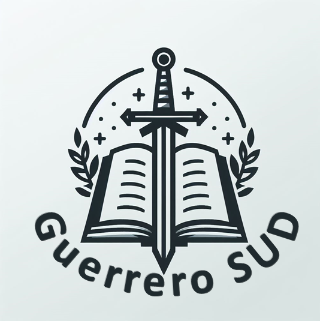

{: .center-img }

> "He aquí, soy discípulo de Jesucristo, el Hijo de Dios. He sido llamado por él para declarar su palabra entre los de su pueblo, a fin de que alcancen la vida sempiterna."
(3 Nefi 5:13)

# Herramientas para estudiar las escrituras
|HERRAMIENTA|DESCRIPCIÓN|LINK|
|---|---|---|
|Biblioteca del Evangelio|Las escrituras, conferencias, manuales, etc.|[Web](https://www.churchofjesuschrist.org/study?lang=spa) / [Android](https://play.google.com/store/apps/details?id=org.lds.ldssa&hl=es) / [Apple](https://apps.apple.com/es/app/biblioteca-del-evangelio/id598329798?ls=1)|
|Dominio de la Doctrina|Aplicación movil para estudiar los pasajes de Dominio de la Doctrina de Seminario.|[Android](https://play.google.com/store/apps/details?id=org.lds.sm&hl=es) / [Apple](https://apps.apple.com/es/app/dominio-de-la-doctrina/id413341700)|
|Índice de Citas de las Escrituras| Puedes buscar una escritura y ver todos los mensajes de la conferencia general donde ha sido mencionada.| [Web](https://escrituras.byu.edu/) / [Android](https://play.google.com/store/apps/details?id=edu.byu.scriptures)|
|WordCruncher|Esta es un software muy poderoso que permite busquedas avanzadas en las escrituras, discursos de la conferencias y la colección de libros de Enseñanzas de los Profetas.|[Windows y Apple](https://wordcruncher.com/install#)|
|LDS View|Versión simplificada de WordCruncher que solo incluye las escrituras.|[Windows](https://ldsview.wordcruncher.com/install)|

# Mis Mensajes

- [¿La Iglesia de Jesucristo es perfecta?](https://getupnote.com/share/notes/V9blG8NdJzNSb4CtOnYQb8L2yxr2/dd05c2cc-d460-4392-a995-bac12c1c16dd) *2017-12-03*
- [El Bautismo](https://getupnote.com/share/notes/V9blG8NdJzNSb4CtOnYQb8L2yxr2/6c68d516-53d9-4c94-9e1b-dba35e6aff4b) *2017-06-24*
- [Jesucristo El Eterno](https://getupnote.com/share/notes/V9blG8NdJzNSb4CtOnYQb8L2yxr2/5585111a-891d-4d5a-88b8-b6ab5a67faec) *2008-11-21*

